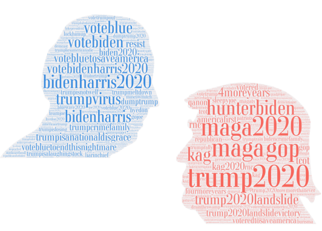
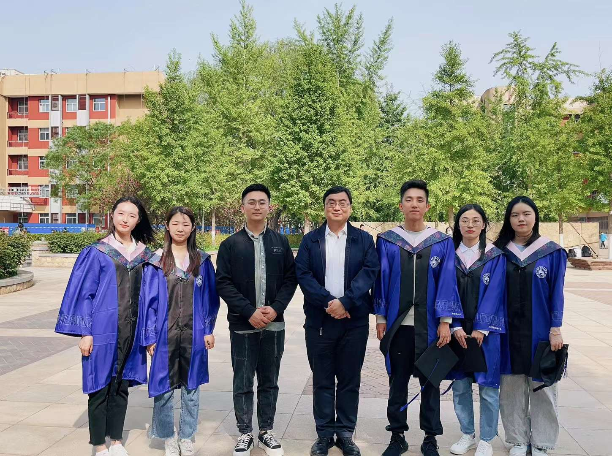

<iconify-icon icon="mingcute:mail-fill"></iconify-icon> Email: zhenkun@cueb.edu.cn

---

  计算机博士，现为首都经济贸易大学统计学院数据科学系讲师，硕士研究生导师。

  研究方向：
  - 计算社会科学
  - 社交网络
  - 自然语言处理
  - 消费大数据

  <!-- Zhenkun Zhou is an assistant professor in Capital University of Economics and Business. 
  He received his Ph.D. degree of computer science from Beihang University in 2020.

  His research focuses on
  - Computational social science
  - Social networks
  - Natural language processing
  - Consumption big data -->

## 近期代表作 Selected Publications

- Suspended accounts align with the Internet Research Agency misinformation campaign to influence the 2016 US election. **EPJ Data Science, 2024**

- Exploring the investment value of retail sales growth: Evidence from the China Retailer Alliance. **Finance Research Letters, 2024**

- DoubleH: Twitter User Stance Detection via Bipartite Graph Neural Networks. **The International AAAI Conference on Web and Social Media (ICWSM), 2024**

- Online Social Behavior Enhanced Detection of Political Stances in Tweets. **The International AAAI Conference on Web and Social Media (ICWSM), 2024**

- Political polarization of news media and influencers on Twitter in the 2016 and 2020 US presidential elections. **Nature Human Behaviour, 2023**

## 人才培养 Teaching

### （1）计算社会科学研究组 Research Group

- 研究生
  - 2021级：何宇馨，岳绪同
  - 2022级：戴晓雯，张静，陈洁

- 本科生
  - 2020级：李冠群，张雨骁
  - 2021级：陈相龙，周怡朱南

- 更多
  - [介绍](./2024/group/) （有意读研请提前了解）
  - [组会回顾](./2024/meeting/)
  - [工具推荐](./2024/tools/)

### （2）讲授课程 Lessons

- 本科
  - 统计编程基础（Statistical Programming）
  - 大数据预处理（Big Data Preprocessing）

- 研究生
  - 非结构化大数据分析（Unstructured Data Analyzing）
  - 数据可视化（Data Visualization）

## 获奖 Awards

- 首届全国高校青年教师数据科学与商业分析案例教学竞赛一等奖、优秀案例题材奖，《基于语言模型的零售商品分类》

- 第十三届市调大赛研究生组全国一等奖，优秀指导教师奖，《果茶相融，“酒”是不同——基于北京市的正大果茶酒消费市场研究》

- 第六届全国应用统计专业学位研究生案例大赛二等奖（指导教师），《基于KD-ERNIE语言模型的零售消费品多层分类算法研究》

- 第八届全国大数据与社会计算学术会议——社会计算创新大赛优秀奖，《社交网络文本抑郁指数构建与计算——以Twitter平台为例》

- 第九届全国大学生统计建模大赛北京赛区本科组——三等奖（指导老师），《北部沿海经济地区县域经济发展测度研究》

- 首都经济贸易大学2023年度校级优秀班主任

## 社会服务 Social services

### 讲座与报告 Talk
- 《浅谈数据科学在企业中的应用及价值》，2023年11月23日，浙江绍兴，有色金属工业统计会议
- 《基于在线社交⽹络的立场挖掘与选举预测研究》，2022年9月7日，河南郑州，强智杯开源数据智能分析分论坛
- 《基于在线社交⽹络的选举预测研究》，2021年7月18日，辽宁锦州，中国商业统计学会市场调查与教学研究分会第32届年会“东方艾学”海归论坛

### 专利与软著 Patent
- 商品品类自动标注软件（2023SR1489972）, 2023年11月
- 基于大语言模型的零售商品分类与标签识别软件（2024SR0409008）, 2024年01月

### Journal Reviewer

- IEEE Transactions on Neural Networks and Learning Systems
- IEEE Transactions on Computational Social Systems
- IEEE Transactions on Big Data
- Cyberpsychology, Behavior, and Social Networking
- Royal Society Open Science
- Big Data & Society
- International Journal of Public Opinion Research
- Humanities & Social Sciences Communications
- Journal of Computational Social Science